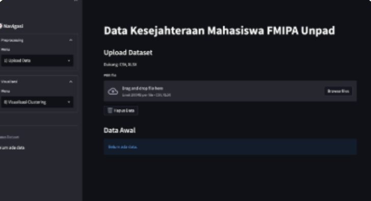
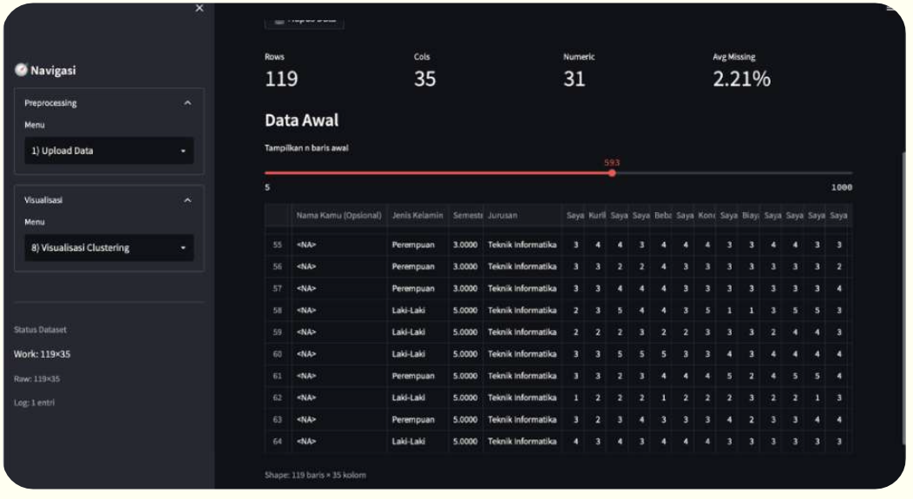
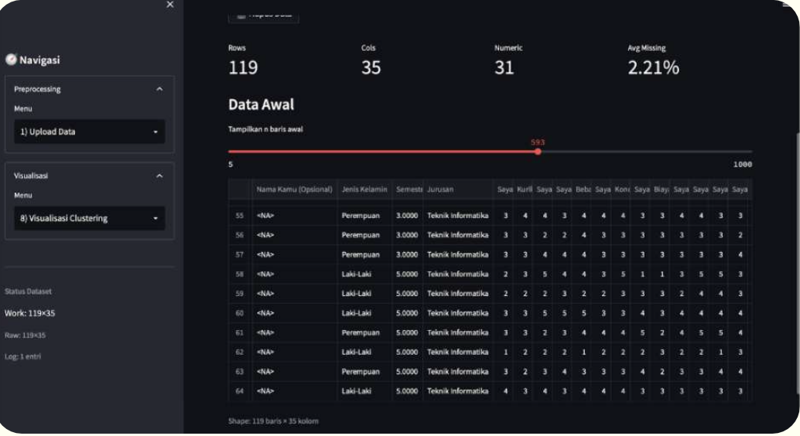
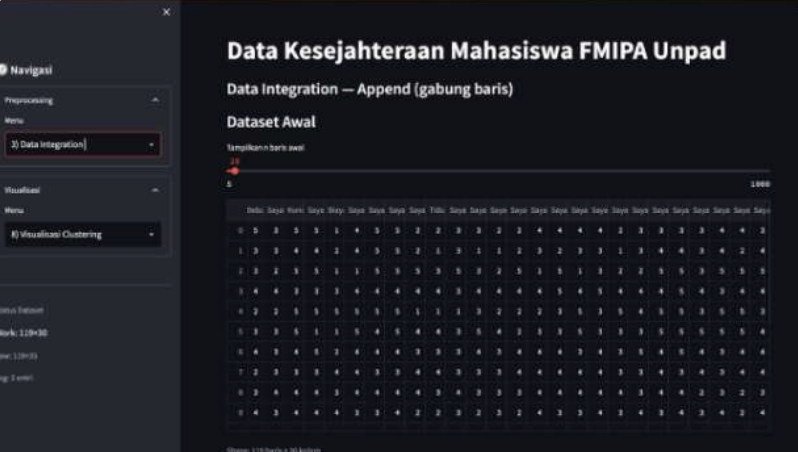
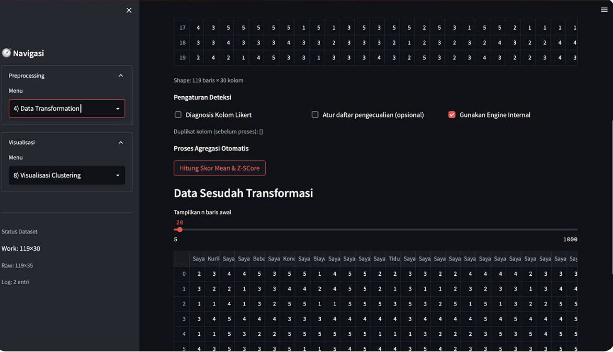
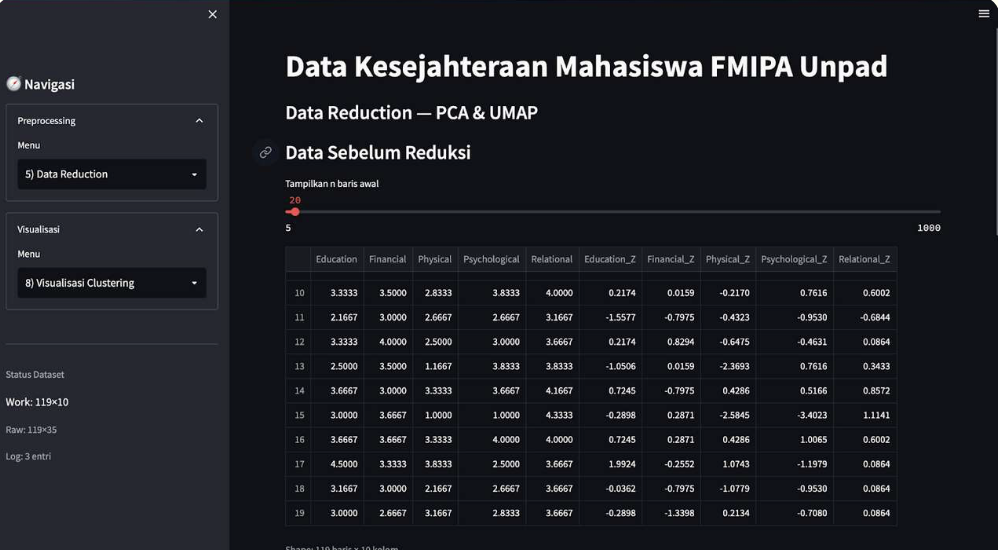
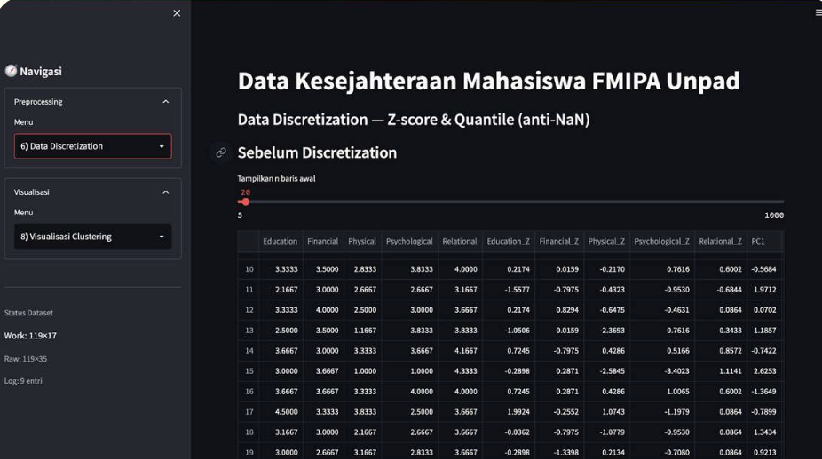
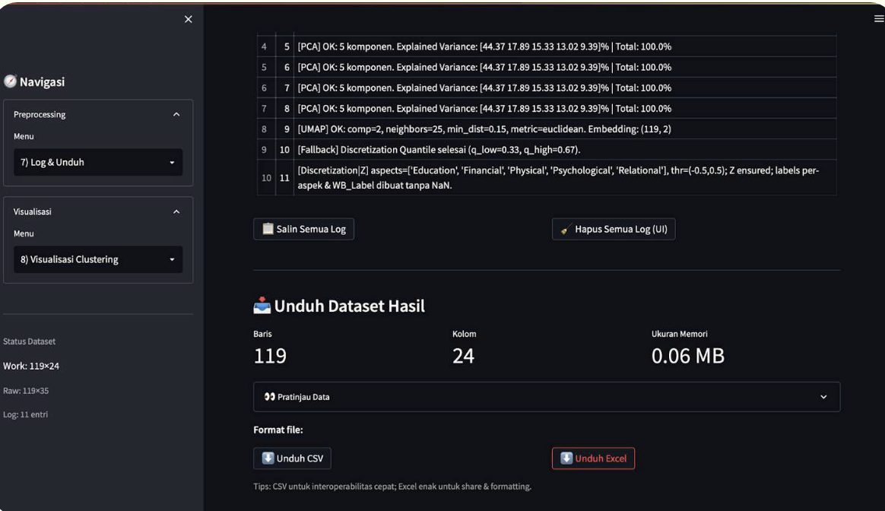
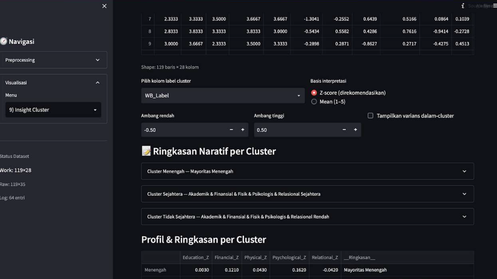
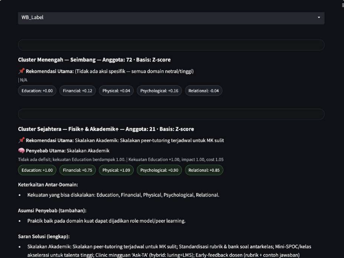

# 🎓 Student Well-Being Analytical Dashboard

**Streamlit-Based Data Mining Application**

An interactive data mining dashboard designed to analyze **student well-being patterns** and generate **actionable insights & policy recommendations** using clustering techniques.

> 👨‍💻 **Role:** Backend Developer
> 👤 **Author:** Dzacky Ahmad
> 🧠 **Domain:** Data Mining · Analytics · Decision Support System

---

## 📌 Overview

This project is a **Streamlit-based analytical dashboard** that implements the **CRISP-DM framework end-to-end**, transforming raw student well-being data into **insights, recommendations, and policy-level action plans**.

The system is designed to help **lecturers, academic advisors, and university decision-makers**:

* Understand student well-being patterns
* Detect at-risk student groups
* Generate **data-driven insights → knowledge → wisdom (policy suggestions)**

---

## 🧠 CRISP-DM Implementation

1. **Business Understanding** – Identifying student well-being problems
2. **Data Understanding** – Exploratory data analysis
3. **Data Preparation** – Cleaning, integration, transformation, reduction, discretization
4. **Modeling** – K-Means, DBSCAN, Hierarchical Clustering
5. **Evaluation** – Cluster interpretation & comparison
6. **Deployment** – Interactive Streamlit dashboard

---

## ✨ Key Features

* Dataset upload via Streamlit
* Modular data preprocessing pipeline
* Multiple clustering algorithms
* Interactive visual analytics
* Automated insight generation
* **Action plan & policy recommendation output (Wisdom level)**

---

## 🖼️ Application Screenshots

### Dashboard Overview



### Data Upload



### Data Cleaning



### Data Integration



### Data Transformation



### Data Reduction



### Data Discretization



### Log & Summary



### Visualization


### Insight Generation



### Action Plan & Policy Recommendation



---

## 📄 Documentation & Supporting Materials

This project is supported by comprehensive documentation to provide deeper technical insights, usage guidance, and academic context.

---

### 📘 Project Report

A complete technical report explaining the background, methodology, CRISP-DM implementation, experiments, and evaluation results.

**Laporan Data Mining**
📄 [Laporan Data Mining](img/Laporan%20Data%20Mining.pdf)

---

### 🧭 User Guide

A step-by-step guide on how to use the Streamlit-based analytical dashboard, including data upload, data processing stages, and interpretation of analytical results.

**Panduan Penggunaan Aplikasi Data Mining**
 [Panduan Penggunaan Aplikasi](img/Panduan%20Penggunaan%20Aplikasi%20Data%20Mining.pdf)

---

### 🖼️ Project Poster

A concise visual summary of the project, suitable for presentations, exhibitions, or academic showcases.

**Poster Data Mining**
📄 [Poster Data Mining](img/Poster%20Data%20Mining.pdf)

---

### 💡 Notes

These supporting materials demonstrate the project’s end-to-end data mining workflow, from raw data processing to automated insight generation and actionable recommendations (wisdom level), making it suitable for both academic evaluation and real-world decision support systems.

---

## 🗂️ Project Structure

```
STREAMLIT-CODE/
│
├── img/
├── Visualisasi/
│
├── app.py
├── DataCleaning.py
├── DataIntegration.py
├── DataTransformation.py
├── DataReduction.py
├── DataDiscretization.py
│
├── requirements.txt
```

---

## ⚙️ Tech Stack

* Python
* Streamlit
* Pandas, NumPy
* Scikit-learn
* Matplotlib, Seaborn
* PCA / UMAP

---

## 🚀 How to Run

```bash
pip install -r requirements.txt
streamlit run app.py
```

---

## 🎯 Project Impact

* Objective student well-being analysis
* Early detection of vulnerable clusters
* Decision support for academic policy

---

## 🧑‍💻 Author

**Dzacky Ahmad**
Informatics Engineering Undergraduate
Backend · Data Mining · Analytics

---

> *Turning data into insights, and insights into meaningful actions.*
